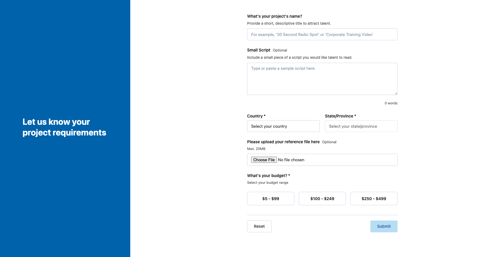

# Voices Job Submission Form - Web Developer Take-Home Assignment

A full-stack web application form for submitting voice acting job opportunities with field requirements, server-side validation, email confirmations, and comprehensive logging. Built with PHP, MySQL, and JS.

## Table of Contents

- [Project Overview](#project-overview)
- [Features](#features)
- [Tech Stack](#tech-stack)
- [Project Structure](#project-structure)
- [Setup Instructions](#setup-instructions)
- [Database Schema](#database-schema)
- [Running the Application](#running-the-application)
- [Testing](#testing)
- [Logging System](#logging-system)
- [Form Validation](#form-validation)
- [Error Handling](#error-handling)
- [Security Features](#security-features)
- [Development Notes](#development-notes)

---

## Project Overview

The **Voices Job Submission Form** is a web application form designed to collect voice acting job opportunities from users. The application features:

- A responsive HTML form with real-time client-side validation
- Comprehensive server-side validation using a custom Validator service
- Email confirmations sent to users upon successful submission
- File upload support for reference materials (PDFs, images, audio, video)
- Centralized logging system for form submissions, database operations, and email activity
- Tests PHPUnit (13 tests) and Cypress E2E tests (19 tests)
- Database persistence using MySQL with proper error handling

**Purpose:** This take-home assignment demonstrates full-stack development skills including form handling, validation, database operations, code organization and testing.

---

## Features

### Form Functionality
- **Job Title Input** - Required text field (max 255 characters)
- **Script/Description** - Optional textarea with real-time word counter (max 1000 words)
- **Country Selection** - Dynamic country dropdown (Canada, US, expandable)
- **State/Province Selection** - Dynamically populated based on selected country
- **Budget Selection** - Radio buttons with 3 pricing tiers:
  - Low: $5–$99
  - Medium: $100–$249
  - High: $250–$499
- **File Upload** - Optional reference file upload (20MB max)
  - Supported formats: PDF, DOC, DOCX, TXT, MP3, WAV, IMG, JPEG, JPG, PNG, MP4, MPEG
  - Files stored securely outside web root in `/storage/uploads/`

### Form Features
- **Form Validation** - Real-time client-side + server-side validation
- **Error Messaging** - User-friendly error messages for each field
- **Reset Button** - Clear all fields with one click
- **CSRF Protection** - Anti-CSRF token on every form submission
- **Honeypot Field** - Bot detection using hidden "website" field
- **Accessibility** - WCAG 2.1 Level AA+: ARIA labels, semantic HTML, role="alert" for errors, natural keyboard navigation, skip link, 7:1 color contrast, 44px touch targets
- **Email Confirmation** - Email sent upon successful submission
- **Responsive Design** - Mobile-first (480px → 600px tablet → 768px desktop) with enhanced touch targets and tablet-specific optimizations

### Backend Features
- **Database Persistence** - All submissions stored in MySQL
- **Logging** - Form submissions, database ops, email activity logged to files
-  **Error Handling** - Graceful error handling with user-friendly feedback
-  **Service-Oriented Architecture** - Validator, Mailer, Logger, FileUpload services
-  **PDO Prepared Statements** - SQL injection prevention
-  **Environment Configuration** - Flexible .env configuration

---

## Tech Stack

| Layer | Technology |
|-------|-----------|
| **Language** | PHP |
| **Database** | MySQL |
| **Frontend** | HTML5, CSS3, Vanilla JavaScript|
| **Testing (Unit/Integration)** | PHPUnit |
| **Testing (E2E)** | Cypress |
| **Package Manager** | Composer |
| **Architecture Pattern** | MVC (Model-View-Controller) |
| **File Storage** | Local filesystem  `/storage/uploads/` |
| **Email** | PHP mail() function |

---

## Project Structure

```
voices-web-developer-project/
├── app/
│   ├── config.php                    # App config autoload
│   ├── Controllers/
│   │   └── JobFormController.php     # Main form submission handler
│   ├── Models/
│   │   └── Job.php                   # Job data model
│   ├── Repositories/
│   │   └── JobRepository.php         # Database operations for jobs
│   ├── Services/
│   │   ├── Logger.php                # Centralized logging service
│   │   ├── Validator.php             # Form validation rules
│   │   ├── Mailer.php                # Email confirmation service
│   │   └── FileUpload.php            # File upload handling (storage/uploads)
│   ├── Views/
│   │   └── form.php                  # Main form template
│   └── helpers.php                   # Global logging helper functions
├── config/
│   └── Database.php                  # Database singleton & PDO connection
├── database/
│   └── migration.sql                 # Database schema (run first!)
├── public/
│   ├── index.php                     # Application entry point
│   ├── script.js                     # Client-side form logic
│   ├── styles.css                    # Form styling with tablet optimization
│   └── Css/styles.css                # Main stylesheet with responsive design
├── storage/
│   ├── uploads/                      # Secure file storage (outside web root)
│   ├── logs/                             # Application logs (auto-created)
    │   ├── form_submission.log
    │   ├── database.log
    │   ├── mailer.log
    │   └── error.log
│   └── .gitignore                    # Prevents uploaded files from git
├── cypress/
│   ├── e2e/
│   │   └── form.cy.js                # E2E test suite (19 tests)
│   ├── fixtures/
│   │   └── example.json              # Test fixtures
│   └── support/
│       ├── commands.js               # Custom Cypress commands
│       └── e2e.js                    # Cypress configuration
├── tests/
│   ├── feature/                      # Feature tests
│   └── unit/
│       └── JobFormTest.php            # Unit Job Form test
├── composer.json                     # PHP dependencies
├── phpunit.xml                       # PHPUnit configuration
├── cypress.config.js                 # Cypress configuration
├── php.ini.dev                       # Development PHP config (20MB upload limit)
├── .env                              # Environment variables
└── README.md                         # This file
```

---

## Setup Instructions

### Prerequisites
- PHP 8.2+ with CLI support
- MySQL 8.0+ database server (Wamp, Xampp)
- Node.js 16+ and npm (for Cypress)
- Composer for PHP dependency management
- A code editor (VS Code or PHPStorm)

### 1. Clone the Repository
```bash
git clone https://github.com/lebronbrian23/voices-web-developer-project
cd voices-web-developer-project
```

### 2. Install PHP Dependencies
```bash
composer install
composer dump-autoload
```

### 3. Setup Environment Variables
Create a `.env` file in the project root by copying .env.example file:
```bash
cp .env.example .env
```

Configure `.env` with:
```env
DB_HOST=localhost
DB_NAME=voices_job_form
DB_USER=root
DB_PASSWORD=your_password
MAIL_TO=your_email@example.com
MAIL_FROM=noreply@example.com
MAIL_FROM_NAME=Voices Job Submission Form
```

### 4. Create and Migrate Database
```bash
# Create the database in MySQL
mysql -u root -p -e "CREATE DATABASE voices_job_form CHARACTER SET utf8mb4 COLLATE utf8mb4_unicode_ci;"

# Run migrations
mysql -u root -p voices_job_form < database/migration.sql
```

Verify tables were created:
```bash
mysql -u root -p -e "USE voices_job_form; SHOW TABLES;"
```

### 5. Set File Permissions
```bash
# Create and permission storage directory for uploads
mkdir -p storage/uploads
chmod 755 storage/uploads
```

### 7. Configure PHP Development Settings (File Upload Support)

This step is **optional but recommended** for testing large file uploads during development.Create a local PHP configuration file that allows file uploads up to 20MB (instead of the system's default 2MB or 8MB).

#### Create It Manually
Create the `php.ini.dev` file at the root of this project:

**Add the code below in `php.ini.dev`:**
```ini
; Custom PHP Configuration for Development
; This overrides the system php.ini for larger file uploads

post_max_size = 20M
upload_max_filesize = 20M
```

### 8. Install Frontend Dependencies (for Cypress)
```bash
npm install
```

### 9. Start the Development Server
```bash
# Using PHP built-in server
php -S localhost:8000 -t public

```
Use this command if you added php.ini.dev 
```bash
# Using PHP built-in server
php -c php.ini.dev -S localhost:8000 -t public 2>&1 | head -20
```

The Application is now accessible at: **http://localhost:8000**

---

## Database Schema

### Jobs Table
```sql
CREATE TABLE jobs (
    id INT PRIMARY KEY AUTO_INCREMENT,
    title VARCHAR(255) NOT NULL,
    script LONGTEXT NULL,
    country CHAR(2) NOT NULL,
    state_or_province VARCHAR(100) NOT NULL,
    reference_file_path VARCHAR(255) NULL,
    budget ENUM('low', 'medium', 'high') NOT NULL,
    ip_address VARCHAR(45) NULL,
    created_at TIMESTAMP DEFAULT CURRENT_TIMESTAMP,
    updated_at TIMESTAMP DEFAULT CURRENT_TIMESTAMP ON UPDATE CURRENT_TIMESTAMP,
    INDEX idx_country (country),
    INDEX idx_created_at (created_at)
);
```

**Fields Explanation:**
- `id` - Unique submission identifier
- `title` - Job title/position name (required)
- `script` - Full job description (optional, nullable)
- `country` - Two-letter country code (CA, US)
- `state_or_province` - State/province name for the position
- `reference_file_path` - Path to uploaded reference file (nullable)
- `budget` - Budget tier (low/medium/high)
- `ip_address` - User's IP address for tracking
- `created_at` - Submission timestamp
- `updated_at` - Last update timestamp

---

## Running the Application

### To access the application
1. Open browser: **http://localhost:8000**
2. Fill out the job submission form
3. Upload optional reference file (if desired)
4. Click "Submit"
5. Check mailer.log for email confirmation (This simulates the actual process of sending an email)

### File Upload Validation

The application has **3 layers of file upload protection**:

#### 1. **Client-Side JavaScript Validation** (runs immediately when submit is clicked)
- Checks if file > 20MB
- Shows user-friendly error before sending
- Prevents large files from reaching server

#### 2. **PHP Configuration Limits** (controlled by local php.ini.dev)
- `post_max_size = 20M`
- `upload_max_filesize = 20M`
- Rejects files exceeding these limits at PHP level

#### 3. **Server-Side Validator**
- Checks MIME type (PDF, TXT, MP3, PNG, JPEG, etc.)
- Validates file size programmatically
- Displays proper error messages on form

**Supported File Types:**
- Images: JPEG, PNG
- Documents: PDF, DOC, DOCX, TXT
- Audio: MP3, WAV, MP4
- Video: MP4, MPEG

**Max File Size:** 20MB

---

## Testing

### PHPUnit - Unit & Integration Tests
```bash
# Run all tests
php vendor/bin/phpunit tests/

# Run specific test file
php vendor/bin/phpunit tests/unit/JobFormTest.php
```

**Test Results:** **13/13 tests passing**

### Cypress - End-to-End Tests
```bash
# Run all E2E tests (headless)
npx cypress run --spec cypress/e2e/form.cy.js

# Open Cypress Test Runner (interactive)
npx cypress open

# Run with specific browser
npx cypress run --browser chrome
```

**Test Results:** **19/19 tests passing**

### What is being Tested

**Backend Tests (PHPUnit):**
- Form validation rules
- File upload handling
- Validator service methods
- Error scenarios

**E2E Tests (Cypress):**
- Form page loading
- All form fields display correctly
- Field input and interaction
- Country/province dropdown dynamics
- Budget selection
- File upload acceptance
- Form reset functionality
- CSRF token presence
- Honeypot field inclusion
- Accessibility attributes
- Placeholder and helper text

---

## Logging System

### Architecture
The logging system uses a centralized `Logger` service with global helper functions, reducing code duplication and providing consistent log formatting.

### Global Helper Functions
All functions available globally after autoload:

```php
log_info($message)                      // General info logging
log_database($message, $success, $data) // Database operations
log_email($message, $success, $data)    // Email activity
log_form($message)                      // Form submissions
log_error($message)                     // Error logging
section($title)                         // Create log section header
```

### Usage Examples

```php
// Log form submission
log_form(section('FORM SUBMISSION RECEIVED'));
log_form("POST Data: " . Logger::data($_POST));

// Log database operation
log_database("INSERT SUCCESSFUL - ID: {$id}", true, $record);
log_database("INSERT FAILED - " . $error, false, $record);

// Log email activity
log_email("EMAIL SENT TO: user@example.com", true, $submission);

// Create section header
section('VALIDATION ERRORS')
// Output: "=== VALIDATION ERRORS ==="
```

### Log Files
Each log type writes to its own file with timestamps and JSON-formatted data:

- **form_submission.log** - Form submissions, validation, processing
- **database.log** - Insert/update operations with data
- **mailer.log** - Email send attempts and results
- **errors.log** - Application errors and exceptions

---

## Form Validation

### Client-Side Validation (JavaScript)
Runs in real-time as user types:
- **Title**: Required, max 255 characters
- **Script**: Optional, max 1000 words with live counter
- **Country**: Required selection
- **State/Province**: Required, dynamic population per country
- **Budget**: Required radio button selection
- **File**: Optional, type and size validation

### Server-Side Validation (PHP Validator)
Runs on form submission, prevents invalid data storage:

### Validation Error Handling
- Errors displayed under respective form fields
- Form data preserved for user correction
- File not preserved (security measure)
- User can fix and resubmit

---

## Security Features

### Protection Mechanisms Implemented
1. **CSRF Token Protection** - Anti-CSRF token generated and validated on every submission
2. **Honeypot Field** - Hidden "website" field catches bot submissions
3. **PDO Prepared Statements** - All database queries use parameterized statements
4. **File Upload Validation** - Whitelist of allowed file types, max size limits
5. **Server-Side Validation** - Never trust client-side input alone
6. **Input Sanitization** - Data cleaned before database storage
7. **SQL Injection Prevention** - PDO binding with proper placeholders
8. **AODA Compliance** - Accessibility features for users with disabilities

### Security Best Practices
- Sensitive configuration in `.env` (not in code)
- Uploaded files stored outside web root access (if possible)
- Error messages logged but not exposed to users
- IP address captured for fraud detection
- Database timestamps (created_at, updated_at) for audit trail

---

## Error Handling

### Form Validation Errors
User-friendly messages displayed in red text:
```
"Title is required"
"Script cannot exceed 1000 words"
"Country is required"
"Please select a valid province"
"Invalid file type. Allowed: PDF, Images, Audio, Video"
```

### Application Errors
- Logged to `errors.log` for developer debugging
- User sees generic "Something went wrong" message
- No sensitive details exposed in UI

### Database Errors
- PDO exceptions caught and logged
- User notified of submission failure
- Error details available to administrator in logs

---

## Development Notes

### Key Design Decisions

1. **MVC Architecture** - Separation of concerns (Model, View, Controller)
2. **Service Layer** - Validator, Mailer, Logger, FileUpload as reusable services
3. **Repository Pattern** - JobRepository handles all database operations
4. **Global Helpers** - Short function names for logging reduce code verbosity
5. **Centralized Logging** - Single Logger class prevents duplicate code
6. **Client + Server Validation** - UX (instant feedback) + security (server verification)

### File Upload Flow
1. User selects file in form
2. Client validates: type + size
3. Form submitted with file
4. Server validates file again
5. File moved to `/storage/uploads/`
6. File path stored in database
7. File path sent in confirmation email

### Email Confirmation Flow
1. Form submitted successfully
2. Database insert completes
3. Email composed with submission details
4. Email sent via `mail()` function
5. Send attempt logged to `mailer.log`
6. User sees success message
7. Confirmation email arrives in inbox (simulated in `mailer.log` log file)

---

## Skills Demonstrated

This project showcases:
-  Full-stack PHP development
-  MySQL database design and operations
-  Client-side JavaScript (ES6+) 
-  Form validation (client + server)
-  RESTful principles
-  Security best practices (CSRF, honeypot, sanitization)
-  Email integration
-  File upload handling
-  Comprehensive testing (unit + E2E)
-  Code organization and architecture
-  Error handling and logging
-  Responsive design
-  AODA accessibility compliance

---

